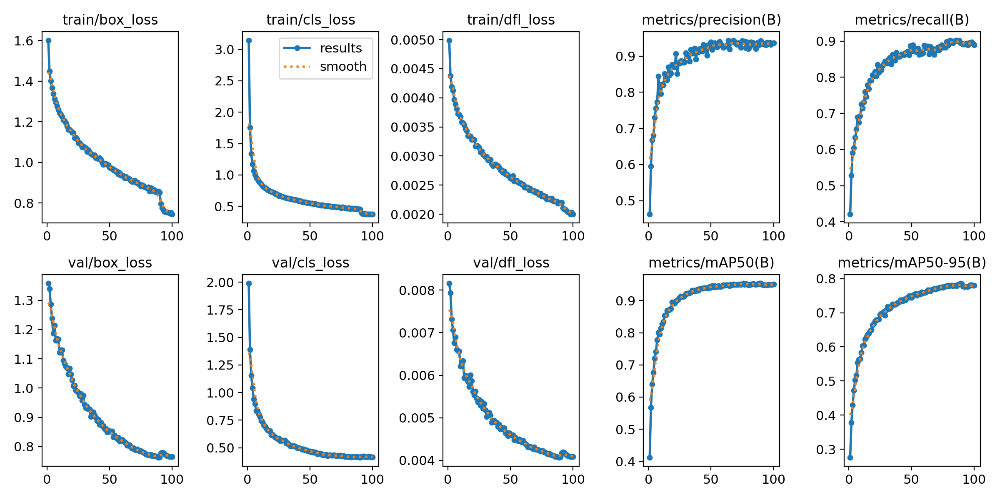

# 基于YOLOv26的车辆跟踪实现

[HuYouming](https://github.com/HuYouming)

Huazhong University of Science and Technology

## 引入

**背景**

针对高位路口监控视频中车辆检测率低的问题。

**目标**

利用[Cutie](https://github.com/hkchengrex/Cutie)减少人工标注数据集时间，训练YOLOv26模型实现对高位视频中车辆的精确识别和跟踪。

## 依赖

- 仅在Ubuntu系统测试过。

- 仅在以下依赖测试过：

  - Python 3.9.25
  - PyTorch 2.7.1 + cu128
  - OpenCV 5.0.0
  - Ultralytics YOLO

## 环境配置

``` bash
conda env creat -f environment.yml
conda activate yolo_env
```

## 快速开始

在环境中，运行以下代码

``` python
# 利用实例视频快速体验，导出视频为result.mp4
python main.py example.mp4 --output result.mp4
```

### 训练模型

**下载预训练模型**

[YOLO26n](https://github.com/ultralytics/assets/releases/download/v8.4.0/yolo26n.pt)

**进行推理**

```python
# 对视频文件进行推理，并保存结果
python main.py "your_video.mp4" --output result.mp4
```

## 数据集

**1. 利用Cutie获取数据集**

- 首先利用Cutie的分割功能选择所要分割的物体（数量不宜过多），产生每一帧的掩码文件夹。
- 快速开始
  ```bash
  # 利用examples的掩码获取对应的YOLO标注,节省人力拉框时间
  python YOLO_Labels_by_Cutie/cutie_mask_to_yolo.py YOLO_Labels_by_Cutie/masks_examples
  ```
- 或自定义
  ```bash
  # 使用你的掩码生成YOLO标注集
  python YOLO_Labels_by_Cutie/cutie_mask_to_yolo.py "your_masks路径"
  ```

**2. KITTI 数据集**

本项目还使用KITTI数据集进行训练和验证。运行训练脚本时，Ultralytics框架会自动下载并准备数据（约390 MB）。

如需手动下载，可以访问 [Ultralytics KITTI 发布页](https://github.com/ultralytics/assets/releases/download/v0.0.0/kitti.zip) 获取压缩包。

## 训练

```python
from ultralytics import YOLO

model = YOLO("yolo26n.pt")  # 加载预训练模型

results = model.train(
    data="kitti.yaml",    # 数据集配置
    epochs=100,           # 训练100轮
    imgsz=640,            # 图片尺寸640×640
    batch=16,             # 每次迭代处理16张图片（批次大小）
    device=0,             # 使用第0块GPU
    workers=8,            # 用8个线程加载数据
    patience=50,          # 如果50轮没提升就提前停止训练
    classes=[0, 1, 2]     # 只训练 car, van, truck 这三个类别
)
```

## 实验结果

- **mAP50 : 0.954**

- **精确率（Precision）:0.92**

- **召回率（Recall）:0.90**



## 项目结构

```text
YOLOv26_test/
├── README.md                    # 项目说明文档
├── environment.yml              # Conda 环境配置
├── main.py                      # 视频推理主程序，加载训练后的权重并保存结果
├── example.mp4                  # 示例输入视频
├── output_video.mp4             # 推理输出示例
├── model/                       # 模型训练相关文件
│   ├── train.py                 # YOLOv26 训练脚本
│   ├── yolo26n.pt               # 预训练权重
│   ├── datasets/
│   │   └── kitti/               # KITTI 数据集与配置
│   │       ├── kitti.yaml       # 数据集配置文件
│   │       ├── images/
│   │       │   ├── train/       # 训练集图像
│   │       │   └── val/         # 验证集图像
│   │       └── labels/
│   │           ├── train/       # 训练集标签
│   │           └── val/         # 验证集标签
│   └── runs/
│       └── detect/              # 训练与验证输出结果
│           ├── train/           # 训练日志、曲线图、可视化结果
│           │   └── weights/     # best.pt / last.pt
│           └── val/             # 验证阶段可视化结果
└── YOLO_Labels_by_Cutie/        # Cutie 掩码转 YOLO 标签工具
    ├── cutie_mask_to_yolo.py    # 掩码转检测框标签脚本
    ├── masks_examples/          # 示例掩码
    ├── labels_masks_examples/   # 由示例掩码生成的 YOLO 标签
    ├── test_labels_default/     # 默认测试标签样例
    └── test_cutie_mask_to_yolo.py # 转换脚本测试
```

以上仅展示核心目录层级，数据集图片、标签文件和训练输出中的大量样本文件未逐一展开。


## 参考与致谢

- [Ultralytics YOLO](https://github.com/ultralytics/ultralytics)
- [Cutie](https://github.com/hkchengrex/Cutie)
- [KITTI Dataset](http://www.cvlibs.net/datasets/kitti/)

感谢雷达站的各位，感谢车流视频素材提供者，感谢无声铃鹿、特别周